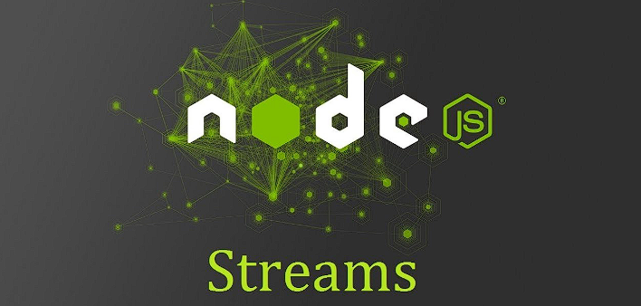

## Project

Node.js with Streams, a Rest API using the HTTP native module and a simple local Database with JSON.

<p style="text-align: center">
  
</p>

This project was developed during a @rocketseat course for study purposes.

## Tech

<table>
  <tbody>
    <tr>
        <td>Node.js</td>
        <td>Streams</td>
        <td>Rest API</td>
        <td>Middleware</td>
        <td>HTTP</td>
        <td>JSON Database</td>
        <td>Regex</td>
    </tr>
  </tbody>
</table>


### Getting Started

Install dependencies

```bash
npm install
```

#### Project 1: Rest API with local JSON database

Start the server on `port: 3333`.
```bash
npm run dev
```

---

#### Project 2: Fake stream upload

Start the server on `port: 3334`.
```bash
npm run stream-server
```

With the server up, run the fake stream upload:

```bash
npm run stream-upload
```


## Contribute

- Fork this repository
- Create a branch with your feature: `git checkout -b my-feature`
- Commit your changes: `git commit -m 'feat: add my new feature'`
- Push it to your branch: `git push origin my-feature`

After merging your pull request, your branch can be deleted.

Check the details about the types, verbs and commit messages here [CONTRIBUTING.md](./.github/CONTRIBUTING.md)

Also check the [CODE_OF_CONDUCT.md](./.github/CODE_OF_CONDUCT.md)

## License

This project is [MIT Licensed](./LICENSE)
